# Quotes App


.png>)
---
.png>)
---

## Prerequisites

Before running Terraform, make sure you have:
 
| Tool       | Install                                           | Check             |
|------------|---------------------------------------------------|-------------------|
| Terraform  | https://developer.hashicorp.com/terraform/install | `terraform -v`    |
| AWS CLI    | https://aws.amazon.com/cli/                       | `aws --version`   |
| kubectl    | https://kubernetes.io/docs/tasks/tools/           | `kubectl version` |
| AWS config | `aws configure`                                   | `aws sts get-caller-identity` |
 
Your AWS IAM user needs permissions for: EKS, EC2, VPC, IAM, EBS.
 
---

## Step by step deployment
 
### 1. Initialise Terraform.
 
Downloads all providers declared in `main.tf`:
 
```bash
terraform init
```
--- 
### 2. Preview what will be created with plan.
 
```bash
terraform plan
```
--- 
### 3. Apply terraform
 
```bash
terraform apply --auto-approve
```
---
### 4. Connect kubectl to the cluster and check the nodes are up.
  
```bash
aws eks update-kubeconfig --region us-east-1 --name quotes-eks
```
 
Verify your 3 worker nodes are Ready:
 
```bash
kubectl get nodes
```


--- 
### 5. Apply the ArgoCD Application
 
```bash
kubectl apply -f argocd-app.yaml
```
 
This is a manual step that connects ArgoCD application to your GitHub repo.

--- 
### 6. Access ArgoCD UI

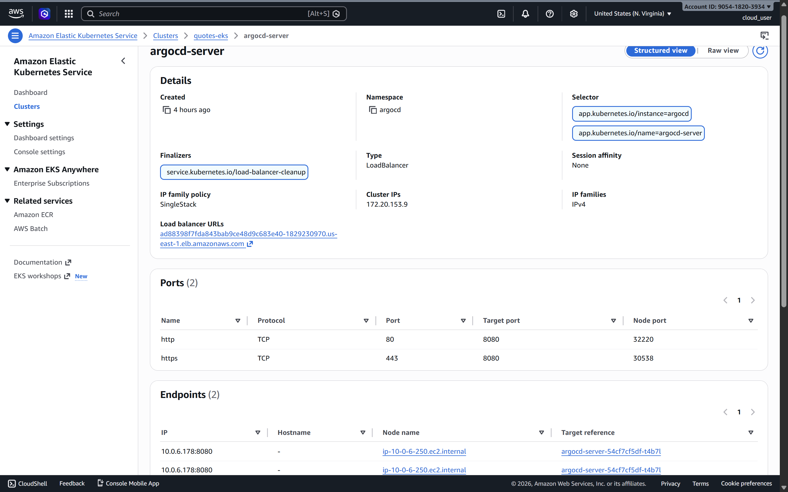

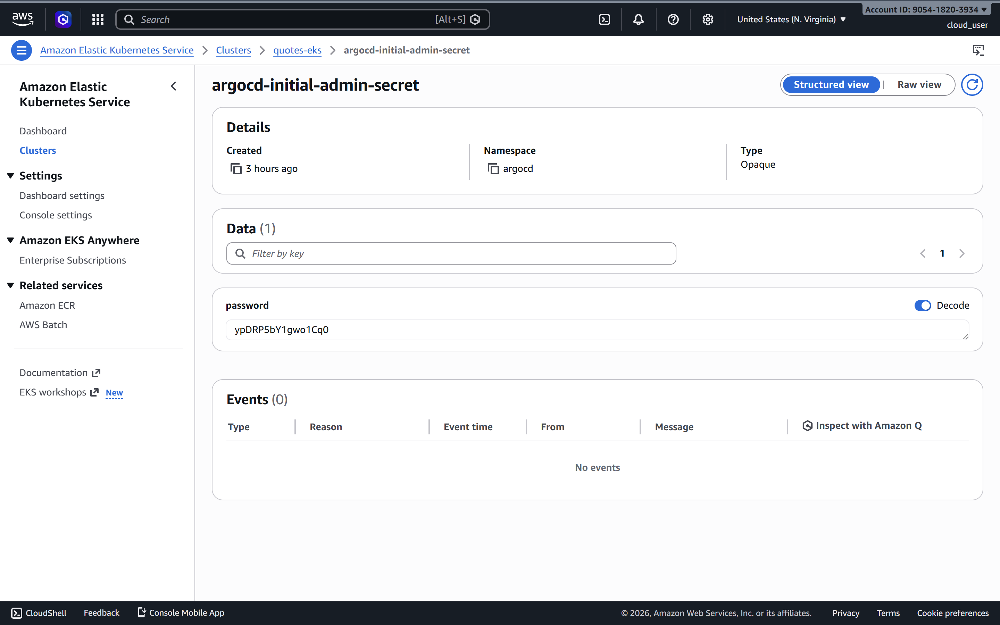

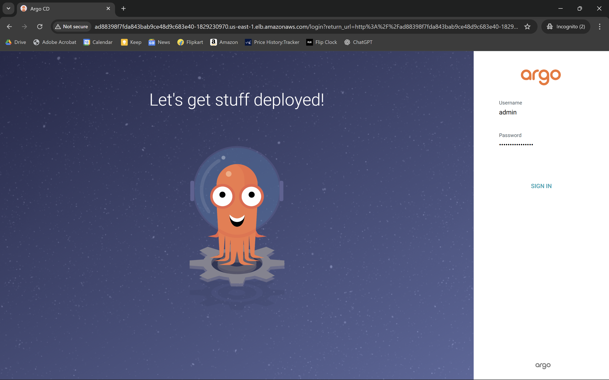

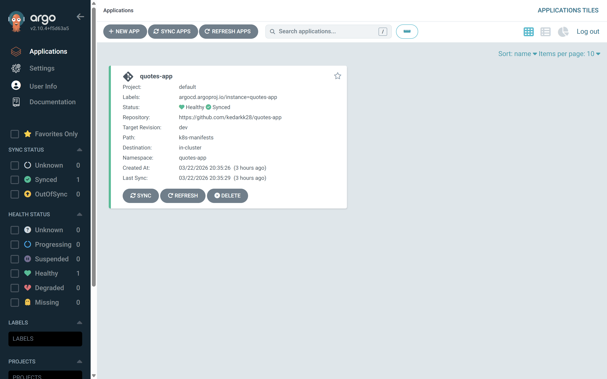

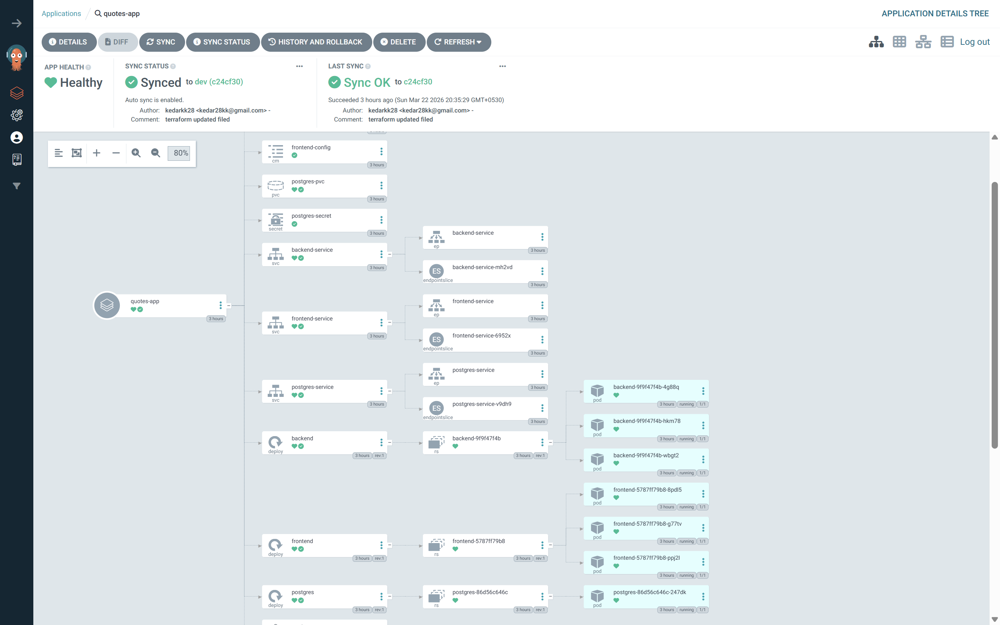

---
### 7. Access the quotes app

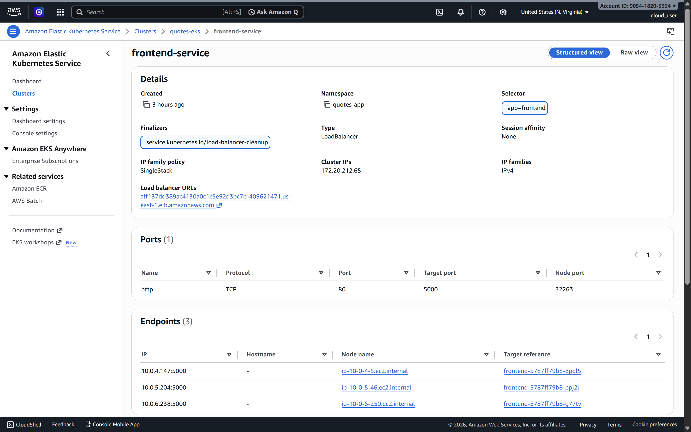

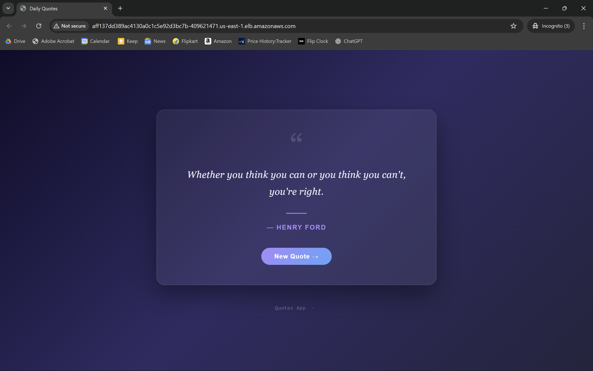

---

### 8. Access Prometheus Dashboard

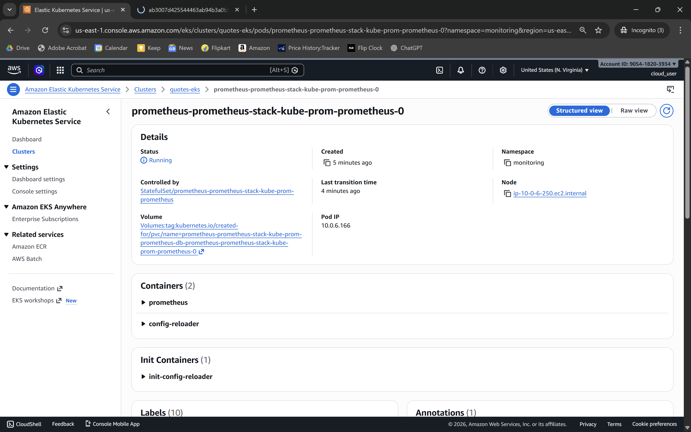

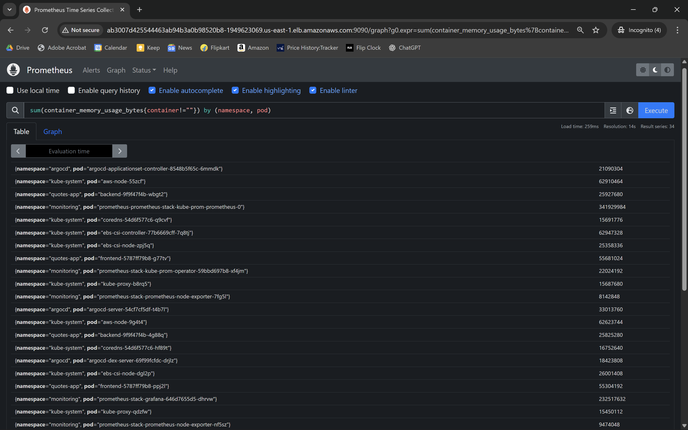

---

### 9. Access Grafana Dashborad

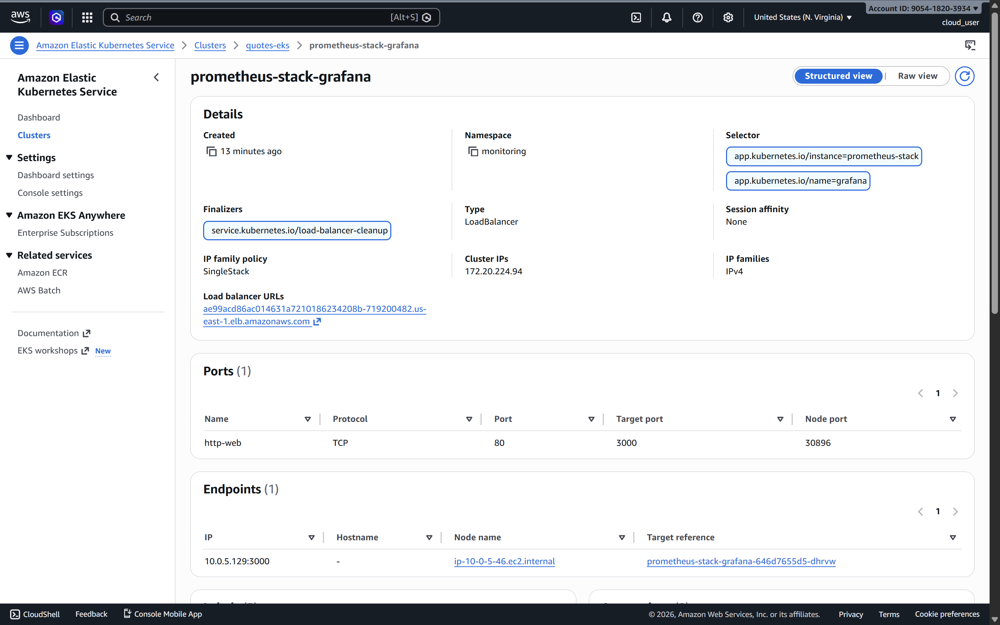


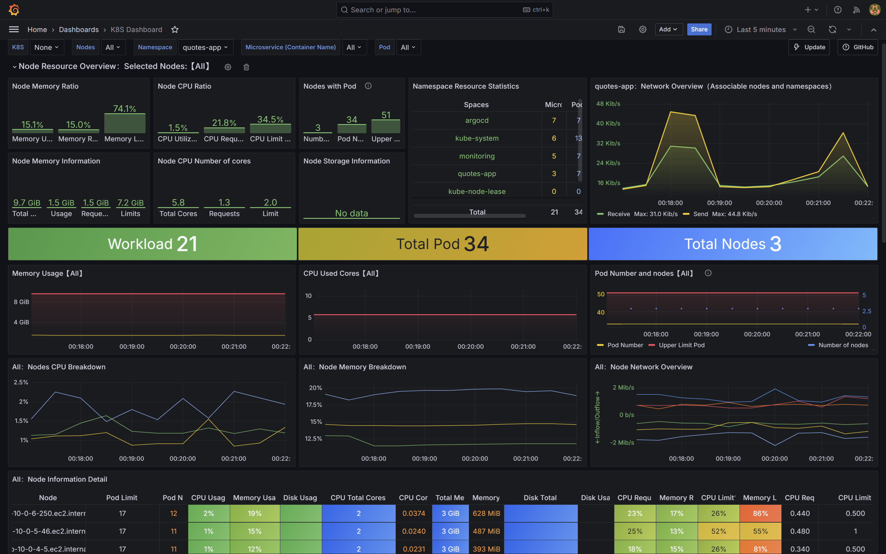

---

### Project Structure

```
quotes-app
├── backend
│   ├── Dockerfile
│   ├── index.js
│   └── package.json
├── frontend
│   ├── app.py
│   ├── Dockerfile
│   ├── requirements.txt
│   └── templates
│       └── index.html
├── k8s-manifests
│   ├── argocd.yaml
│   ├── backend
│   │   ├── configmap.yaml
│   │   ├── deployment.yaml
│   │   └── service.yaml
│   ├── frontend
│   │   ├── configmap.yaml
│   │   ├── deployment.yaml
│   │   └── service.yaml
│   └── postgres
│       ├── deployment.yaml
│       ├── pvc.yaml
│       ├── secret.yaml
│       └── service.yaml
├── README.md
└── terraform
    ├── argocd.tf
    ├── eks.tf
    ├── iam.tf
    ├── main.tf
    ├── outputs.tf
    ├── prometheus-grafana.tf
    ├── terraform.tfstate
    ├── terraform.tfstate.backup
    ├── terraform.tfvars
    ├── variables.tf
    └── vpc.tf
```

---

