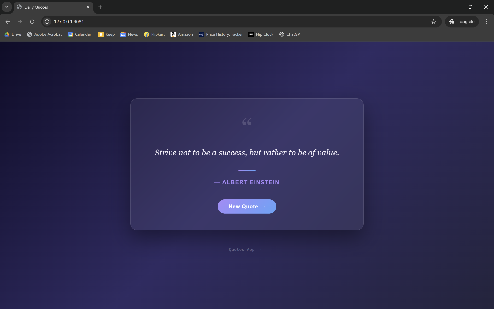

# Quotes App

---



---


---


---
## 1. Clone and run the Quotes App

- Clone the quotes app repository:
  ```bash
  git clone https://github.com/kedarkk28/quotes-app.git
  cd quotes-app
  ```

- Apply the Kubernetes yaml manifests for the quotes app:
  ```bash
  kubectl apply -f k8s-specifications/
  ```

- Forward the ports to access the frontend for quotes app:
  ```bash
  kubectl port-forward svc/frontend-service 9081:81 -n quotes-app > /dev/null 2>&1 &
  ```

---

## 2. Install Argo CD to implement GitOps:
- Create a namespace for Argo CD:
  ```bash
  kubectl create namespace argocd
  ```

- Apply the yaml manifest file for Argo CD:
  ```bash
  kubectl apply -n argocd -f https://raw.githubusercontent.com/argoproj/argo-cd/stable/manifests/install.yaml
  ```

- View the services in argocd namespace:
  ```bash
  kubectl get svc -n argocd
  ```

- Change the service from ClusterIP to NodePort:
  ```bash
  kubectl patch svc argocd-server -n argocd -p '{"spec": {"type": "NodePort"}}'
  ```

- Forward the port to access Argo CD server and run in background:
  ```bash
  kubectl port-forward -n argocd service/argocd-server 8443:443 > /dev/null 2>&1 &
  ```
---

## 3. Install Prometheus with Grafana:

- Install using helm:
  ```bash
  helm repo add prometheus-community https://prometheus-community.github.io/helm-charts
  helm repo add stable https://charts.helm.sh/stable
  helm repo update
  kubectl create namespace prometheus
  helm install kind-prometheus prometheus-community/kube-prometheus-stack --namespace prometheus --set prometheus.service.nodePort=30000 --set prometheus.service.type=NodePort --set grafana.service.nodePort=31000 --set grafana.service.type=NodePort --set alertmanager.service.nodePort=32000 --set alertmanager.service.type=NodePort --set prometheus-node-exporter.service.nodePort=32001 --set prometheus-node-exporter.service.type=NodePort
  kubectl get svc -n prometheus
  kubectl get namespace
  ```

- Forward the ports to access Prometheus and Grafana Dashboard:
  ```bash
  kubectl port-forward -n prometheus svc/kind-prometheus-kube-prome-prometheus 9090:9090 > /dev/null 2>&1 &

  kubectl port-forward -n prometheus svc/kind-prometheus-grafana 9444:80 > /dev/null 2>&1 &
  ```
